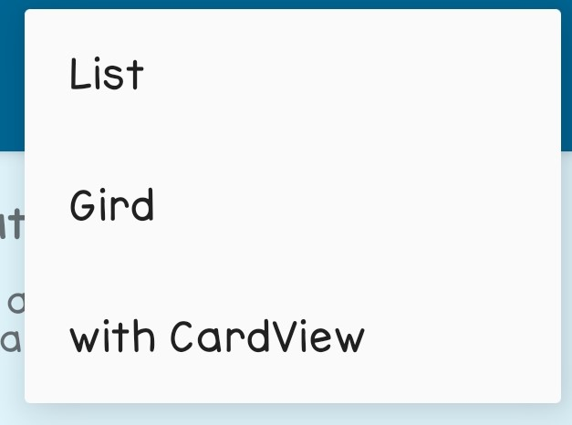
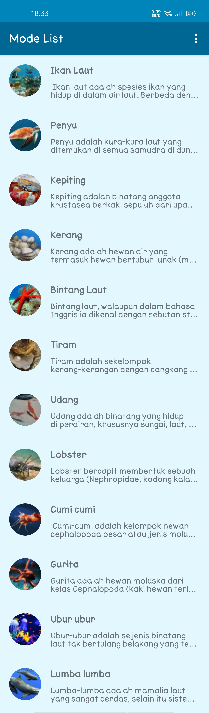
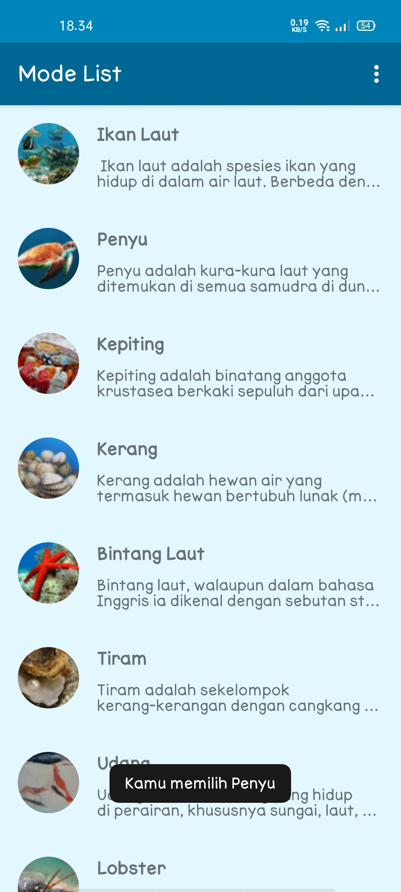
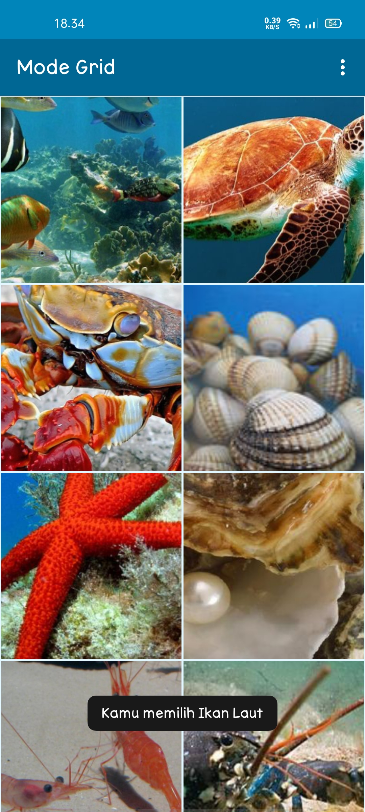
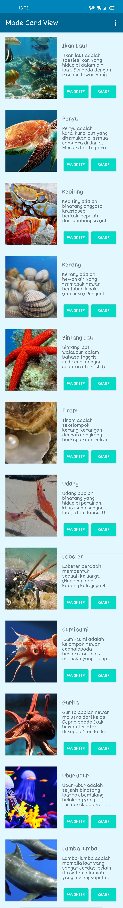
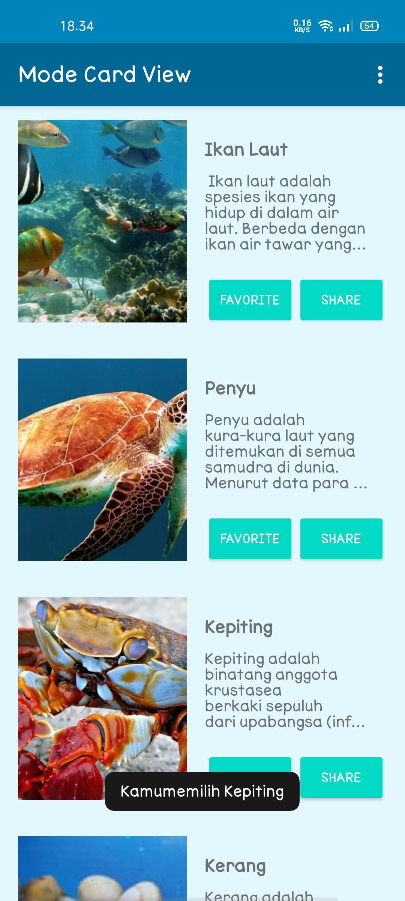

# MyRecyclerView
Kelas [RecyclerView](https://google-developer-training.github.io/android-developer-fundamentals-course-concepts/idn/Unit%202/44_c_recyclerview.html) adalah versi ListView yang lebih canggih dan fleksibel. Widget ini adalah kontainer untuk menampilkan rangkaian data besar yang bisa digulir secara sangat efisien dengan mempertahankan tampilan dalam jumlah terbatas.

Hasil dari Modul MyRecyclerView

- Masuk Aplikasi

Terdapat titik 3 yang berisi menu

Jika memilih menu List maka tampilan seperti ini :

Pada List akan menampilkan Gambar, Nama, dan Detail

Jika memilih salah satu menu akan muncul seperti ini :

Jika memilih menu Grid maka tampilan seperti ini :

Pada Grid akan menampilkan gambar saja

Jika memilih salah satu menu akan muncul seperti ini :

Jika memilih menu Card dan View maka tampilan seperti ini :

Sedangkan pada card view Gambar, dan informasi

Jika memilih salah satu menu akan muncul seperti ini :

Jika memilih salah satu menu akan muncul seperti ini :

Terimakasih

# Salsabilla Maurettasya A

# 39/XIRPL3
